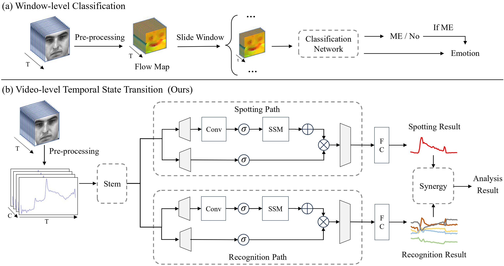
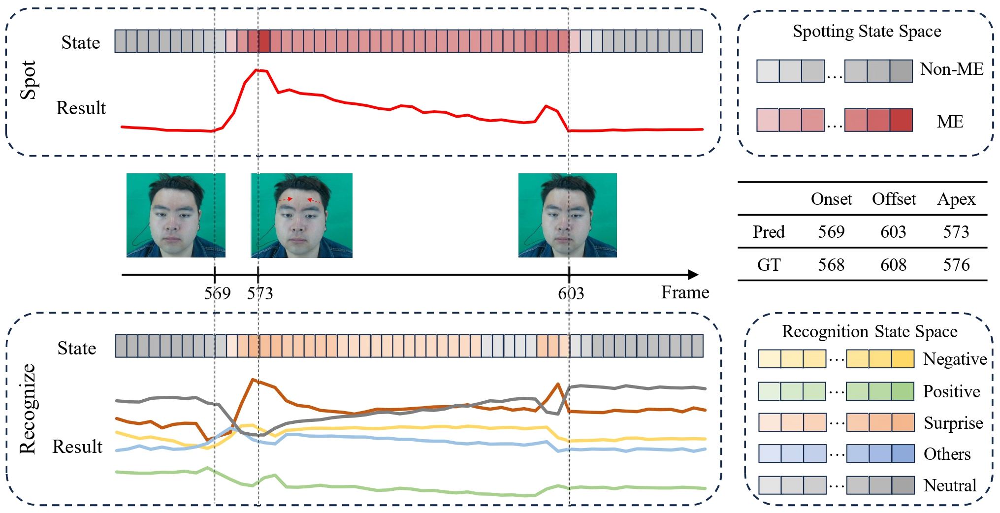

# ME-TST

Synergistic Spotting and Recognition of Micro-Expression via Temporal State Transition [ICASSP 2025]


Framework:




Visualization results




## 🔧 Setup

STEP1: `bash setup.sh`

STEP2: `conda activate ME-TST`

STEP3: `pip install -r ./requirements.txt` 


## 💻 Example of Using Pre-trained Models

If you want to run the pre-trained model on SAMMLV, use `python main.py --dataset_name SAMMLV --train False --flow_process False`


## 💻 Examples of Neural Network Training

STEP 1: Download the $CAS(ME)^3$ raw data by asking the paper authors

STEP 2: Modify `main.py; load_excel.py; load_images.py`

STEP 3: Run `python main.py --dataset_name CASME_3 --train True --flow_process True`


## 🎓 Acknowledgement

We referred to [MEAN_Spot-then-recognize](https://github.com/genbing99/MEAN_Spot-then-recognize), and would like to express our sincere thanks to the authors.


## 📜 Citation

If you find this repository helpful, please consider citing:

```
@article{zou2024synergistic,
  title={Synergistic Spotting and Recognition of Micro-Expression via Temporal State Transition},
  author={Zou, Bochao and Guo, Zizheng and Qin, Wenfeng and Li, Xin and Wang, Kangsheng and Ma, Huimin},
  journal={arXiv preprint arXiv:2409.09707},
  year={2024}
}
```
